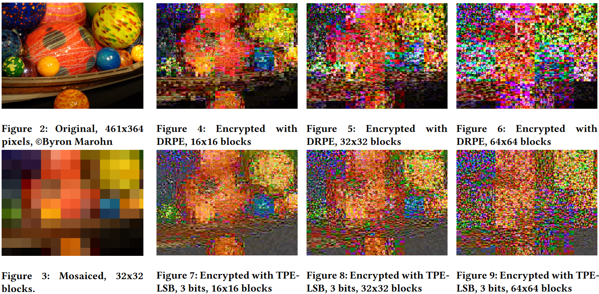

# Figleaf

## Introduction

This project implements several schemes for approximate thumbnail preserving
encryption for JPEG images. It depends on the jpeg-6b library for manipulating
JPEG data and the Sodium library for encryption / decryption.

For more information, see the paper here:
https://dl.acm.org/doi/10.1145/3137616.3137621

Example from the paper:

## Legal / License
Note that this repository has not been maintained since 2017. We make no
promises that the code here is functional, useful, or correct.

If you do want to use the code here for something, please do so under the terms
of the AGPL license - i.e. make your code also available as open source under a
similar license. See the LICENSE file for more detail.

Some included files have their own licenses:
- The jpeg-6b library, with license located in [figleaf/jpeg-6b/README](figleaf/jpeg-6b/README).
- The ATT&T faces dataset, with license located in [figleaf-torch-nn/sample_data/ATT_README](figleaf-torch-nn/sample_data/ATT_README).

## Repository Layout
figleaf - This folder contains the code which implements many different
encryption/decryption schemes which are selectable via command-line arguments.
See the usage when running the figleaf tool for more info.

figleaf-torch-nn - Implementation of a Torch-based neural network based on the
paper here: https://arxiv.org/abs/1609.00408 This tool was originally designed
to identify faces even when images have been blurred/mosaic'd, and is included
here as an adversary to evaluate the resilliance of the image encryption
schemes against a sophisticated adversary.

## Software Authors
- [Charles Wright](https://github.com/cvwright)
- [Byron Marohn](https://github.com/Combustible)
